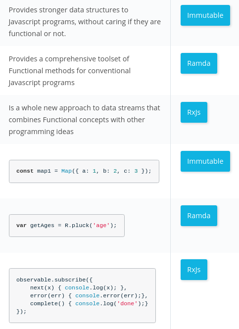

# 5 Going Further with Functional JS

## Immutable Data Structure vs. Persistent Data Structures

- persistent data structures: once a value is created it can never be changed. Persistant data Structure is a data structure that always preserves the previous version of itself when it is modified. Such data structures are effectively **immutable**, as their operations do not (visibly) update the structure in-place, but instead always yield a new updated structure.

## [ImmutableJS](https://immutable-js.com/)
ImmutableJS is a library that gives us Persistent Data Structures in JavaScript

### Map
```js
const Immutable = require('immutable');

// Map
const map = Immutable.Map({ 
  name: 'Wash',
  ship: {
      name: 'Serenity',
      class: 'Firefly'
  },
  role: 'Pilot',
});

// Map - Set operation

map.set('name','Augusto')
   .set('role','Commander');


console.log(map.toJS())

// Merge Maps

const mergedMap = map.merge(anotherRandomMap1, anotherRandomMap2);

```

### List
```js

const numbersList = Immutable.List([1, 2, 3])

console.log(Array.from(numbersList));

const myList1 = numbersList.set(0, '-1');
const myList1 = numbersList.set(1, '-2');
const myList1 = numbersList.set(2, '-3');
const myList2 = myList1.push('-4')
const myList2 = myList1.delete(3) // removing -4

```

### Immutable Code vs Non-Immutable Code

```js
let immutableStore = Immutable.Map({ 
    user: Immutable.Map({ 
        firstName: 'John', 
        lastName: 'Doe' 
    }), 
})

function updateImmutableStore(state, newState) {
    store = state.merge(newState)
    render(root, store)
}


let store = {
    user: {
        first_name: 'John',
        last_name: 'Doe'
    }
}

const updateStore = (store, newState) => {
    store = Object.assign(store, newState)
    render(root, store)
}

```

## [RxJS](https://rxjs-dev.firebaseapp.com/guide/overview)
RxJS is a library for composing asynchronous and event-based programs by using observable sequences. It provides one core type, the Observable, satellite types (Observer, Schedulers, Subjects) and operators inspired by Array#extras (map, filter, reduce, every, etc) to allow handling asynchronous events as collections.

The essential concepts in RxJS which solve async event management are:

- Observable: represents the idea of an invokable collection of future values or events.
- Observer: is a collection of callbacks that knows how to listen to values delivered by the Observable.
- Subscription: represents the execution of an Observable, is primarily useful for cancelling the execution.
- Operators: are pure functions that enable a functional programming style of dealing with collections with operations like map, filter, concat, reduce, etc.
- Subject: is equivalent to an EventEmitter, and the only way of multicasting a value or event to multiple Observers.
- Schedulers: are centralized dispatchers to control concurrency, allowing us to coordinate when computation happens on e.g. setTimeout or requestAnimationFrame or others.

## [Ramda](https://ramdajs.com/)
Ramda is a functional library for JavaScript.

```js
R.append('tests', ['write', 'more']); //=> ['write', 'more', 'tests']
R.append('tests', []); //=> ['tests']
R.append(['tests'], ['write', 'more']); //=> ['write', 'more', ['tests']]
```

## ImmutableJS vs Ramda vs RxJs
