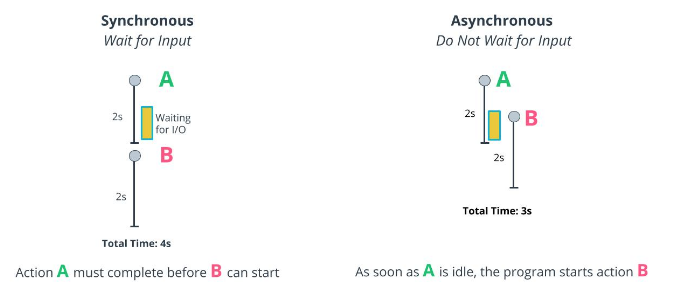
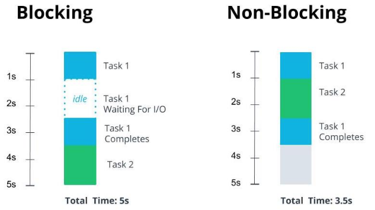

# Intro Asynchronous Programming

- Asynchronous patterns are used for tasks like API requests, file reading and writing, and in general for requests to external processes
- Asynchronous programming helps write code that runs faster by being more efficient with the computing power available

## Blocking and Non-Blocking Recap
Blocking refers to a task that stops all work on the thread until it is complete. A non-blocking task allows the program to go on with other tasks while waiting for something to finish. 

- Synchronous programs use blocking code. Asynchronous programs use non-blocking code 

- Article about [Blocking and Non Blocking Function Calls](https://saimulticorecomputing.wordpress.com/2014/06/25/blocking-and-non-blocking-function-calls/)
- Article II about [Overview of Blocking vs Non-Blocking](https://nodejs.org/en/docs/guides/blocking-vs-non-blocking/)

## JS Asynchronous non-blocking I/O
 JavaScript moves I/O operations to a new thread via an internal API. This is what is meant when JavaScript is described as a "single threaded programming language with asynchronous non-blocking I/O".

 ## Udacity Recommended Articles and Books
- [Eloquent JavaScript - ](https://eloquentjavascript.net/)
  - JavaScript and the Browser
  - The Document Object Model
  - Handling Events
- [Introducing asynchronous JavaScript](https://developer.mozilla.org/en-US/docs/Learn/JavaScript/Asynchronous/Introducing)
- [*Async JavaScript: From Callbacks, to Promises, to Async/Await*](https://ui.dev/async-javascript-from-callbacks-to-promises-to-async-await/)
- [Getting to know asynchronous JavaScript: Callbacks, Promises and Async/Await](https://medium.com/codebuddies/getting-to-know-asynchronous-javascript-callbacks-promises-and-async-await-17e0673281ee)
- [General asynchronous programming concepts](https://developer.mozilla.org/en-US/docs/Learn/JavaScript/Asynchronous/Concepts)
- [Introduction to web APIs](https://developer.mozilla.org/en-US/docs/Learn/JavaScript/Client-side_web_APIs/Introduction)